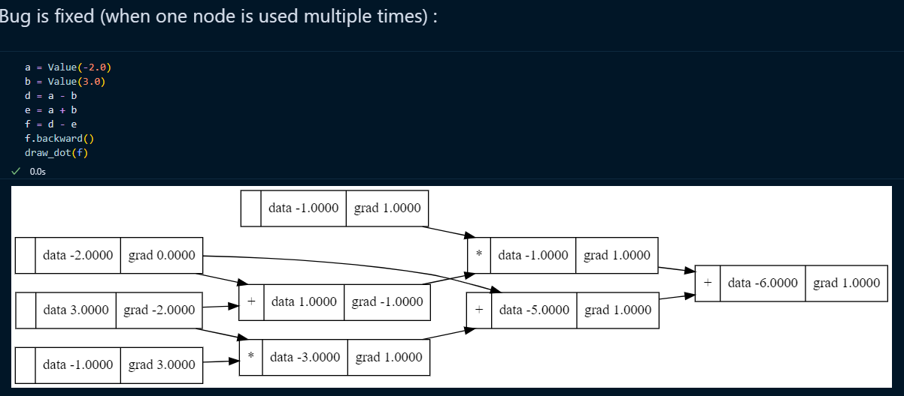
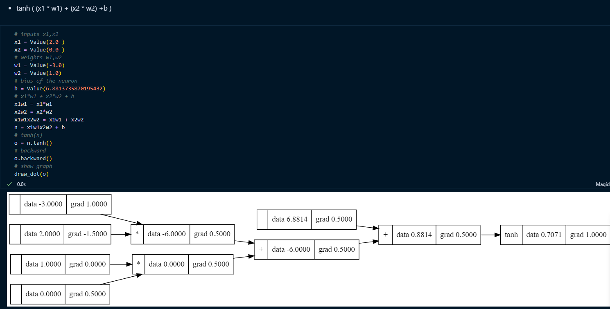

# Readme in other languages

- [English](README.md)

## Sources :

- https://github.com/karpathy/micrograd
- https://youtu.be/VMj-3S1tku0?si=oh67Hy1ful5pJzqg
- https://github.com/karpathy/nn-zero-to-hero/tree/master/lectures/micrograd

## Clone the repository

- `git clone ....`
- `conda create --name micrograd-env`
- `conda activate micrograd-env`
- `pip install -r requirements.txt`
- `conda install python-graphviz` ( If you encounter the error: "RuntimeError: Make sure the Graphviz executables are on your system's path" )

---

# Micrograd An Introduction to Neural Networks and Backpropagation

Dive into the world of neural networks and backpropagation, a repository inspired by Andrej Karpathy's enlightening tutorial on Micrograd. This beginner-friendly guide aims to provide a step-by-step understanding of neural networks and backpropagation through the implementation of the minimalistic framework called Micrograd.

### Micrograd

Micrograd is a small [<strong>Autograd engine:link:</strong>](#AutogradEngineDescription),implying it's a tool for `automatic differentiation (backpropagation)`. It's designed to handle <strong>reverse-mode autodiff</strong>, which is a technique used in training neural networks.This engine operates over a dynamically constructed <strong>Directed Acyclic Graph (DAG)</strong> .

Micrograd is a minimalist framework for doing backpropagation with numpy. It's designed to be a teaching tool, and to be easy to read and understand. It's also designed to be flexible and modular, so that it can be used as a base for more sophisticated frameworks.

To achieve this, we decompose each neuron into its constituent tiny additions and multiplications. Remarkably, this simple approach suffices to construct complete deep neural networks capable of binary classification.

### Exemple

### Implementation

> [!WARNING]
> Before diving into Micrograd, it's essential to have a understanding of [<strong>Derivation:link:</strong>](#derivation). If you lack this foundational knowledge, it's advisable to familiarize yourself with it beforehand.

#### Engine

We have created a class named `Value` in file `Engine.py`, which is initialized with:

```python
def __init__(self,data,_children=(),_op='') :
        self.data=data
        self.grad=0.0 # NOTE : (gardient) We chose 0 because we suppose that this variable has no effect on the output.

        # internal variables used for autograd graph construction
        self._backward=lambda:None # NOTE : this is function that make the calcul of the gradient
        self._prev=set(_children) # children
        self._op=_op # NOTE : operation used for graphviz / debugging / etc

```

operations within the `Value` class :

- Additions & Multiplication

```python
    def __add__(self, other): # self + other
        other=other if isinstance(other,Value) else Value(other)
        out=Value(self.data+other.data,(self,other),'+')
        def _backward():
            self.grad += 1.0*out.grad
            other.grad += 1.0*out.grad
        out._backward=_backward
        return out

    def __mul__(self, other): # self * other
       other=other if isinstance(other,Value) else Value(other)

       out = Value(self.data*other.data,(self,other),'*')
       def _backward():
           self.grad += other.data * out.grad
           other.grad += self.data * out.grad
       out._backward = _backward
       return out
```

- Power :

```python

    def __pow__(self, other): # self ** other
        assert isinstance(other, (int, float)), "only supporting int/float powers for now"
        out = Value(self.data**other, (self,), f'**{other}')

        def _backward():
            self.grad += other * (self.data ** (other - 1)) * out.grad
        out._backward = _backward

        return out
```

```python
    def __neg__(self): # -self => self*(-1)
        return self * -1

    def __sub__(self, other): # self - other => self + (-other)
        return self + (-other)

    def __truediv__(self, other): # self / other  => self * (other**-1)
        return self * other**-1

    def __radd__(self,other): # other + self
        return self+other

    def __rsub__(self, other): # other - self
        return other + (-self)

    def __rmul__(self,other): # other * self
        return self*other

    def __rtruediv__(self, other): # other / self
        return other * self**-1

    def __repr__(self):
        return f"Value(data={self.data}, grad={self.grad})"
```

We have defined various functions (such as [activation functions:link:](#ActivationsFunction) ) within the `Value` class:

```python
    def exp(self):
        x = self.data
        out = Value(math.exp(x), (self, ), 'exp')

        def _backward():
            self.grad += out.data * out.grad
        out._backward = _backward

        return out

    def tanh(self):
        out =Value((math.exp(2*self.data)-1)/(math.exp(2*self.data)+1), (self,),'tanh')

        def _backward():
            self.grad += (1-out.data**2)*out.grad

        out._backward=_backward

        return out

    def relu(self):
        out = Value(0 if self.data < 0 else self.data, (self,), 'ReLU')

        def _backward():
            self.grad += (out.data > 0) * out.grad
        out._backward = _backward

        return out
```

> [!NOTE]
> The += operator in the \_backward() function, when calculating the gradient, is used for accumulation, particularly when one node is used multiple times in the computation graph.

<p align="center">
  
</p>

And the last is the backword function : for that we need first use [topological order:link:](#TopologicalOrder) all of the children in the graph

```python
    def backward(self):
        # topological order all of the children in the graph
        topo = []
        visited = set()
        def build_topo(v):
            if v not in visited:
                visited.add(v)
                for child in v._prev:
                    build_topo(child)
                topo.append(v)
        build_topo(self)

        # go one variable at a time and apply the chain rule to get its gradient
        self.grad = 1
        for v in reversed(topo):
            v._backward()

```

For testing purposes, we provide a file named `EngineTesting.ipynb`:

- `EngineTesting.ipynb`: This Jupyter Notebook file contains tests and examples to demonstrate the functionality of the engine.

For visualization, we offer a function named `draw_dot`, which is located in the file `DAG.py`:

- `draw_dot` function: This function, located in the file `DAG.py`, is used for visualization purposes. It helps visualize the computation graph in a format that can be rendered by Graphviz.

<p align="center">
  
</p>

---

# Informations

- <strong id="AutogradEngineDescription">Autograd engine : </strong> Autograd is a tool used for derivative calculation. It tracks operations on values with enabled gradients and builds a dynamic computational graph (a graph without cycles. Input `values serve as the leaves of the graph`, while `output values act as its roots`. `Gradients are computed by traversing the graph from root to leaf, applying the chain rule to multiply gradients at each step`).

- <strong id="ActivationsFunction">Activations function : </strong> Activation functions are a fundamental component of artificial neural networks (ANNs) used in AI and machine learning. They introduce non-linearity to the network, allowing it to learn complex patterns and relationships in data.

- <strong id="TopologicalOrder">Topological order : </strong> Topological order refers to the linear ordering of vertices in a directed graph such that for every directed edge (u, v) from vertex u to vertex v, u comes before v in the ordering. In simpler terms, it's an ordering of the nodes in a graph where all the dependencies of a node appear before the node itself.

## Derivation

The <strong id="derivation">derivative</strong> of a function describes the function's instantaneous rate of change at a certain point. Another common interpretation is that the derivative gives us the slope of the line tangent to the function's graph at that point

<p align="center">
  
</p>

- the derivative of y with respect to x is defined as the change in y over the change in x, as the distance between x0 and x1 becomes infinitely small :

<p align="center">
  
</p>

- Chain rule : The chain rule is a fundamental concept in calculus that describes how to differentiate composite functions. It states that if a function f is composed of two or more functions, then the derivative of f with respect to an independent variable x can be expressed as the product of the derivatives of the component functions.
<p align="center">
  
</p>
