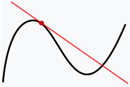

# Readme in other languages

- [English](README.md)

## Sources :

- https://github.com/karpathy/micrograd
- https://youtu.be/VMj-3S1tku0?si=oh67Hy1ful5pJzqg
- https://github.com/karpathy/nn-zero-to-hero/tree/master/lectures/micrograd

## Clone the repository

- `git clone ....`
- `conda create --name micrograd-env`
- `conda activate micrograd-env`
- `pip install -r requirements.txt`

---

# Micrograd An Introduction to Neural Networks and Backpropagation

Dive into the world of neural networks and backpropagation, a repository inspired by Andrej Karpathy's enlightening tutorial on Micrograd. This beginner-friendly guide aims to provide a step-by-step understanding of neural networks and backpropagation through the implementation of the minimalistic framework called Micrograd.

### Micrograd

micrograd is a small [<strong>Autograd engine:link:</strong>](#AutogradEngineDescription),implying it's a tool for `automatic differentiation (backpropagation)`. It's designed to handle <strong>reverse-mode autodiff</strong>, which is a technique used in training neural networks.This engine operates over a dynamically constructed <strong>Directed Acyclic Graph (DAG)</strong> .

micrograd is a minimalist framework for doing backpropagation with numpy. It's designed to be a teaching tool, and to be easy to read and understand. It's also designed to be flexible and modular, so that it can be used as a base for more sophisticated frameworks.

To achieve this, we decompose each neuron into its constituent tiny additions and multiplications. Remarkably, this simple approach suffices to construct complete deep neural networks capable of binary classification.

### Exemple :

### Implementation :

> [!WARNING]
> Before diving into Micrograd, it's essential to have a understanding of [<strong>Derivation:link:</strong>](#derivation). If you lack this foundational knowledge, it's advisable to familiarize yourself with it beforehand.

---

# Informations

- <strong id="AutogradEngineDescription">Autograd engine : </strong> Autograd is a tool used for derivative calculation. It tracks operations on values with enabled gradients and builds a dynamic computational graph (a graph without cycles. Input `values serve as the leaves of the graph`, while `output values act as its roots`. `Gradients are computed by traversing the graph from root to leaf, applying the chain rule to multiply gradients at each step`).

## Derivation :

The <strong id="derivation">derivative</strong> of a function describes the function's instantaneous rate of change at a certain point. Another common interpretation is that the derivative gives us the slope of the line tangent to the function's graph at that point

  

- the derivative of y with respect to x is defined as the change in y over the change in x, as the distance between x0 and x1 becomes infinitely small :

  

